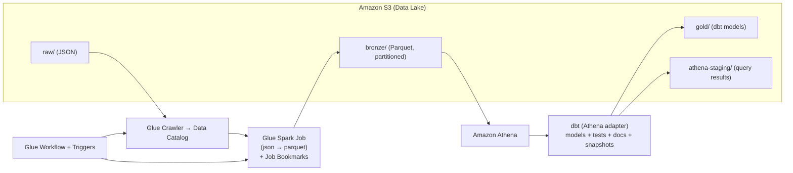

# **Lab 07 - Building Reusable ELT Pipelines on AWS with Glue & dbt**

##  Overview

You’ll build a lakehouse-style ELT pipeline that **lands raw JSON in S3**, **discovers schema with Glue Crawler**, **converts to Parquet with a reusable Glue Spark job (bookmarks)**, and **transforms curated models with dbt (Athena)**. You’ll orchestrate the Glue steps with a **Glue Workflow** and verify results in **Athena**.

##  What is AWS Glue?

AWS Glue is a **serverless data integration** service: discover (Crawler), catalog (Data Catalog), and transform (Spark jobs / Python shell). It scales without servers to manage.

##  What is dbt?

**dbt (data build tool)** lets you **transform data with SQL** using modular **models, tests, documentation, snapshots**, and **macros**—perfect for reproducible analytics engineering. In this lab we’ll use **dbt on Athena** so your data stays in S3, metadata in the Glue Data Catalog.

##  Important Features You’ll Use

* **Glue Crawler** → automatic schema discovery into the **Glue Data Catalog**
* **Glue Spark Job** → JSON → **Parquet**, **partitioning**, **job bookmarks** (incremental)
* **Glue Workflow & Triggers** → orchestrate Crawler → Job
* **dbt on Athena** → **modular SQL models**, **incremental** builds, **tests**, **macros**, **docs**
* **S3 + Athena** → low-ops lakehouse querying

##  Practical Use Case

**Clickstream → Analytics:**
Marketing stores daily website logs in S3. Glue **discovers** & **optimizes** data (Parquet), dbt builds **curated marts** (dimensions & facts), and analysts query via **Athena/BI**. Each day, new files arrive, Glue **bookmarks** prevent reprocessing, dbt **incremental models** update fast.

---

##  Reference Architecture



---

#  Part A — Environment (Windows PowerShell)

### 0) Prerequisites

* **AWS CLI** installed & configured (`aws configure`)
* **Python 3.9+** and **pip**
* IAM user/role with permissions for **S3, Glue, Athena, CloudWatch**
* You’ll use a public dataset from AWS Glue samples.

### 1) Set Variables (PowerShell)

```powershell
$env:AWS_REGION = "us-east-1"
$env:LAB        = "glue-dbt-lab-2807"           # must be globally unique for S3
$env:S3_DATA    = "$($env:LAB)-data"
$env:S3_LOGS    = "$($env:LAB)-logs"
$env:S3_STAGE   = "$($env:LAB)-athena-staging"  # Athena query results
```

### 2) Create S3 Buckets & Folders

```powershell
aws s3 mb "s3://$env:S3_DATA"  --region $env:AWS_REGION
aws s3 mb "s3://$env:S3_LOGS"  --region $env:AWS_REGION
aws s3 mb "s3://$env:S3_STAGE" --region $env:AWS_REGION

aws s3api put-object --bucket $env:S3_DATA --key "raw/"
aws s3api put-object --bucket $env:S3_DATA --key "bronze/"
aws s3api put-object --bucket $env:S3_DATA --key "gold/"
```

### 3) Copy Sample Data to **raw/**

We’ll use the **AWS Glue us-legislators** sample:

```powershell
aws s3 cp "s3://awsglue-datasets/examples/us-legislators/all/" `
          "s3://$env:S3_DATA/raw/us-legislators/" --recursive
```

---

#  Part B — Glue Data Catalog (Crawler)

### 4) Create a Glue Database

```powershell
aws glue create-database --database-input Name=$env:LAB
```

### 5) Create & Run a Crawler (Console)

1. AWS Console → **Glue** → **Crawlers** → **Create crawler**
2. **Data source**: `s3://$env:S3_DATA/raw/us-legislators/`
3. **IAM role**: create new (e.g., `AWSGlueServiceRole-<name>`)
4. **Target database**: `$env:LAB`
5. **Schedule**: On demand
6. Create & **Run** the crawler → verify tables in **Glue Data Catalog** under database **$env:LAB**.

> Why: The Crawler infers schema and registers tables for Glue jobs & Athena.

---

#  Part C — Reusable Glue Transform (JSON → Parquet + Bookmarks)

### 6) Create the Reusable Spark Script `json_to_parquet.py`

Save this file locally:

```python
import sys
from awsglue.utils import getResolvedOptions
from pyspark.sql import SparkSession
import pyspark.sql.functions as F

# Parameters: --src s3://... --dst s3://... --partition_col <col> --bookmarks enable|disable
args = getResolvedOptions(sys.argv, ['JOB_NAME','src','dst','partition_col','bookmarks'])
src = args['src']; dst = args['dst']; pcol = args['partition_col']; bookmarks = args['bookmarks']

spark = SparkSession.builder.appName("json-to-parquet").getOrCreate()

# Read JSON
df = spark.read.json(src)

# Simple standardization (lowercase col names)
for c in df.columns:
    df = df.withColumnRenamed(c, c.lower())

# Ensure partition column exists
if pcol not in df.columns:
    df = df.withColumn(pcol, F.lit("unknown"))

# Write Parquet (partitioned)
(df
 .repartition(1)                 # small demo: coalesce files
 .write
 .mode("append")                 # bookmarks prevent reprocessing
 .partitionBy(pcol)
 .parquet(dst))

spark.stop()
```

### 7) Upload the Script to S3

```powershell
aws s3 cp .\json_to_parquet.py "s3://$env:S3_DATA/script/"
```

### 8) Create the Glue Job (Console)

* Glue → **ETL Jobs** → **Create** → Spark (Glue 4.0/5.0)
* **Script location**: `s3://$env:S3_DATA/script/json_to_parquet.py`
* **Job parameters** (add as key/value):

  * `--src` = `s3://$env:S3_DATA/raw/us-legislators/`
  * `--dst` = `s3://$env:S3_DATA/bronze/us_legislators/`
  * `--partition_col` = `dataset`
  * `--bookmarks` = `enable`
* **Job bookmarks**: **Enable** in the job’s advanced properties
* **Monitoring/Logs**: point to `s3://$env:S3_LOGS/`
* **Run** the job

> Why: Parquet + partitioning improve cost/perf; **bookmarks** skip files already processed.

---

#  Part D — Orchestrate with Glue Workflow

### 9) Create a Workflow with Triggers (Console)

* Glue → **Workflows** → **Create**
* Add **Crawler** → then **json_to_parquet** **Job**
* Add **trigger**: start **Job** on **Crawler success**
* (Optional) Add a **schedule** trigger to kick off the workflow nightly
* **Run** the workflow → see Crawler then Job execute.

> Why: You can reuse this pattern for many datasets by re-parameterizing the job.

---

#  Part E — Athena Setup (Query Results)

### 10) Set Athena Query Result Location

* Athena console → **Settings** → Output: `s3://$env:S3_STAGE/`
* Choose or create a **workgroup** if desired.

---

#  Part F — dbt on Athena (Transform BRONZE → GOLD)

### 11) Install dbt (Athena adapter)

In a virtual environment:

```powershell
python -m venv .venv
. .\.venv\Scripts\Activate.ps1
python -m pip install --upgrade pip
python -m pip install dbt-core dbt-athena
```

### 12) Initialize a dbt Project

```powershell
mkdir dbt_legislators
cd dbt_legislators
dbt init legislators
```

### 13) Configure `profiles.yml` for Athena (Windows path)

Create/edit `C:\Users\<YOU>\.dbt\profiles.yml`:

```yaml
legislators:
  target: dev
  outputs:
    dev:
      type: athena
      region_name: us-east-1
      database: glue-dbt-lab-2807          # same as $env:LAB
      schema: dbt_dev                      # logical schema/namespace
      s3_staging_dir: s3://glue-dbt-lab-2807-athena-staging/
      s3_data_dir:    s3://glue-dbt-lab-2807-data/gold/
      s3_data_naming: table_unique
      threads: 4
```

> Replace names to match your **$env:LAB**, **$env:S3_STAGE**, **$env:S3_DATA**.

### 14) Declare your Source (points to Crawler table or an external table over bronze)

`models/sources.yml`

```yaml
version: 2
sources:
  - name: bronze
    database: glue-dbt-lab-2807    # $env:LAB
    schema: default
    tables:
      - name: us_legislators       # Glue Crawler table name (adjust if different)
```

> Tip: For best performance, you can **CREATE EXTERNAL TABLE** in Athena over the Parquet path (`s3://.../bronze/us_legislators/`) and reference that table as the source.

### 15) Models: Staging & Marts

`models/stg/stg_legislators.sql`

```sql
{{ config(materialized='view') }}
select
  lower(name)        as name,
  lower(gender)      as gender,
  try_cast(birthdate as date) as birthdate,
  dataset
from {{ source('bronze','us_legislators') }}
```

`models/marts/dim_person.sql`

```sql
{{ config(materialized='table', tags=['dim']) }}
select
  name,
  gender,
  year(birthdate) as birth_year
from {{ ref('stg_legislators') }}
where birthdate is not null
```

`models/marts/fct_legislator_counts.sql`

```sql
{{ config(materialized='incremental',
          unique_key='name',
          incremental_strategy='insert_overwrite') }}
select
  name,
  count(*) as cnt
from {{ ref('stg_legislators') }}
group by 1

  -- add a predicate here if you partition the staging source

```

### 16) Reusable Macro & Tests

`macros/standardize_names.sql`

```sql

lower(regexp_replace({{ col }}, '[^a-zA-Z0-9 ]', ''))

```

Use it anywhere:

```sql
select {{ standardize_names('name') }} as clean_name
from {{ ref('stg_legislators') }}
```

`models/schema.yml`

```yaml
version: 2
models:
  - name: dim_person
    columns:
      - name: name
        tests: [not_null]
```

### 17) Run dbt

```powershell
dbt debug
dbt run --select stg_legislators dim_person fct_legislator_counts
dbt test
dbt docs generate
dbt docs serve
```

Verify:

* **Athena** shows new **tables/views** in database `$env:LAB`, schema `dbt_dev`.
* **S3** has **gold/** outputs and **athena-staging/** query artifacts.

---

#  Part G — Practice Drills (Make it Real)

1. **New dataset, same flow**

   * Copy a different public dataset to `raw/`
   * Re-run **Workflow** (Crawler → Job) with params: `--src`, `--dst`, `--partition_col`
   * Add new **dbt source** + model and build

2. **Partition awareness**

   * Modify the Glue script to partition by a real column (e.g., `year`)
   * Add dbt **incremental** predicates that limit rebuilds to recent partitions

3. **Quality gates**

   * Add dbt **tests**: `unique`, `not_null`, `accepted_values`
   * Fail your CI if tests fail

4. **Docs & lineage**

   * `dbt docs generate` and **serve**—walk learners through lineage graphs

---

#  Cleanup (avoid charges)

```powershell
# Delete Glue workflow, job, crawler (Console is easiest)
# Then remove S3 buckets:
aws s3 rb "s3://$env:S3_DATA"  --force
aws s3 rb "s3://$env:S3_LOGS"  --force
aws s3 rb "s3://$env:S3_STAGE" --force
```

---

##  What You Learned

* How **Glue Crawler** + **Data Catalog** power schema-on-read
* How to build a **reusable Glue Spark job** (params + bookmarks)
* How to orchestrate with a **Glue Workflow**
* How to implement **modular, tested SQL transforms** with **dbt on Athena**
* How to design **reusable ELT patterns** you can replicate across domains

---
